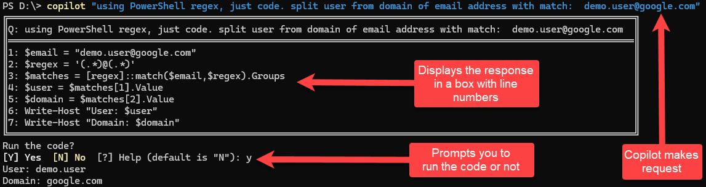
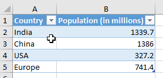

>

# Unleash the Power of Artificial Intelligence with PowerShell
Welcome to the PowerShell Artificial Intelligence repository! Here, you will find a collection of powerful PowerShell scripts that will enable you to easily integrate AI into your projects and take them to the next level. Imagine being able to interact directly with OpenAI's GPT AI with just a few simple commands. With this module, it's now possible.

## Get Ahead of the Game
By using this module, you'll have the ability to add cutting-edge AI functionality to your projects without needing to have a deep understanding of the underlying technology. This means you can stay focused on what you do best while still being able to work with the latest and greatest.

## Start Your AI Journey Today

### Installation

In the PowerShell console:

```powershell
Install-Module -Name PowerShellAI
```

Get/Create your OpenAI API key from [https://beta.openai.com/account/api-keys](https://beta.openai.com/account/api-keys) and then set `$env:OpenAIKey`.

## Examples
Check out these PowerShell scripts to see how easy it is to get started with AI in PowerShell:

|PS Script | Description | Location
|--|--|--|
| Disable-AIShortCutKey | Disable the <kbd>ctrl+g</kbd> shortcut key go getting completions | [Disable-AIShortCutKey.ps1](./Public/Disable-AIShortCutKey.ps1) |
| Enable-AIShortCutKey | Enable the <kbd>ctrl+g</kbd> | [Enable-AIShortCutKey.ps1](./Public/Enable-AIShortCutKey.ps1) |
| Get-OpenAIEdit | Given a prompt and an instruction, the model will return an edited version of the prompt | [Get-OpenAIEdit.ps1](./Public/Get-OpenAIEdit.ps1)
| Get-GPT3Completion | Get a completion from the OpenAI GPT-3 API | [Get-GPT3Completion.ps1](./Public/Get-GPT3Completion.ps1)
| Get-DalleImage | Get an image from the OpenAI DALL-E API | [Get-DalleImage.ps1](./Public/Get-DalleImage.ps1)
| ai | Experimental AI function that you can pipe all sorts of things into and get back a completion | [ai.ps1](./Public/ai.ps1)
| copilot | Makes the request to GPT, parses the response and displays it in a box and then prompts the user to run the code or not. | [copilot.ps1](./Public/copilot.ps1)
| Get-DalleImage | Get an image from the OpenAI DALL-E API | [Get-DalleImage.ps1](./Public/Get-DalleImage.ps1)
| Set-DalleImageAsWallpaper | Set the image from the OpenAI DALL-E API as the wallpaper | [Set-DalleImageAsWallpaper.ps1](./Public/Set-DalleImageAsWallpaper.ps1)

<br/>

## Demos of the PowerShellAI

Here are some vidoes of `PowerShellAI` in action:

| Description | YouTube Video |
|--|--|
| Quick Demo of PowerShellAI | <a href="https://youtu.be/fpq9TDpaCuU"> |
| Using PowerShell with OpenAI GPT in the console with a shortcut key | <a href="https://youtu.be/Y2fJki6r4mI"> |
| PowerShell AI - `copilot` at the command line | <a href="https://youtu.be/JrNBvEm6E7Q"> |
| PowerShell AI - new `ai` function | <a href="https://youtu.be/-mlkUVUPZHU"> |
| New-Spreadsheet script: PowerShell + ChatGPT + Excel | <a href="https://youtu.be/Aehsgtll1CA"> |

<br/>
<br/>

## What it looks like

> ***Note:*** You can use the `gpt` alias for `Get-GPT3Completion`

```powershell
Get-GPT3Completion "list of planets only names as json"

[
    "Mercury",
    "Venus",
    "Earth",
    "Mars",
    "Jupiter",
    "Saturn",
    "Uranus",
    "Neptune"
]
```

### As XML

```powershell
Get-GPT3Completion "list of planets only names as xml"


<?xml version="1.0" encoding="UTF-8"?>
<planets>
  <planet>Mercury</planet>
  <planet>Venus</planet>
  <planet>Earth</planet>
  <planet>Mars</planet>
  <planet>Jupiter</planet>
  <planet>Saturn</planet>
  <planet>Uranus</planet>
  <planet>Neptune</planet>
</planets>
```

### As Markdown

```powershell

 Get-GPT3Completion "first 5 US presidents and terms as markdown table"


| President | Term |
|----------|------|
| George Washington | 1789-1797 |
| John Adams | 1797-1801 |
| Thomas Jefferson | 1801-1809 |
| James Madison | 1809-1817 |
| James Monroe | 1817-1825 |
```

Copy and pasted into this README.md:

| President | Term |
|----------|------|
| George Washington | 1789-1797 |
| John Adams | 1797-1801 |
| Thomas Jefferson | 1801-1809 |
| James Madison | 1809-1817 |
| James Monroe | 1817-1825 |


## `ai` function

The `ai` function calls that allows `piping` and `prompting` text. This is useful for chaining commands together.

```powershell
ai "list of planets only names as json"
```

```json
[
    "Mercury",
    "Venus",
    "Earth",
    "Mars",
    "Jupiter",
    "Saturn",
    "Uranus",
    "Neptune"
]
```
 

```powershell
ai "list of planets only names as json" | ai 'convert to  xml'
```

```xml
<?xml version="1.0" encoding="UTF-8"?>
<Planets>
    <Planet>Mercury</Planet>
    <Planet>Venus</Planet>
    <Planet>Earth</Planet>
    <Planet>Mars</Planet>
    <Planet>Jupiter</Planet>
    <Planet>Saturn</Planet>
    <Planet>Uranus</Planet>
    <Planet>Neptune</Planet>
</Planets>
```        

```powershell
ai "list of planets only names as json" | ai 'convert to  xml' | ai 'convert to  powershell'
```

```powershell
[xml]$xml = @"
<?xml version="1.0" encoding="UTF-8"?>
<Planets>
    <Planet>Mercury</Planet>
    <Planet>Venus</Planet>
    <Planet>Earth</Planet>
    <Planet>Mars</Planet>
    <Planet>Jupiter</Planet>
    <Planet>Saturn</Planet>
    <Planet>Uranus</Planet>
    <Planet>Neptune</Planet>
</Planets>
"@

$xml.Planets.Planet
```

## Use `ai` with `git`

Pipe the output of `git status` to `ai` to create a commit message.

```powershell
git status | ai "create a detailed git message"
```

```
Commit message:
Added PowerShellAI.psd1, README.md, changelog.md, and Public/ai.ps1 to dcf-spike-piping-to-ai-function branch. Updated PowerShellAI.psd1 and README.md with new changes. Added changelog.md to track changes. Added Public/ai.ps1 to enable piping to AI function.
```

# Copilot at the PowerShell Console

Thank you to [Clem Messerli](https://twitter.com/ClemMesserli/status/1616312238209376260?s=20&t=KknO2iPk3yrQ7x42ZayS7g) for posting a great prompt to show `copilot` in action.



Check out the [video of `copilot` in action]()

# Code editing example

Unlike completions, edits takes two inputs: the `text` to edit and an `instruction`. Here the `model` is set to `code-davinci-edit-001` because we're working with PowerShell code.

- Here you're passing in the string that is a PowerShell function.
- The `instruction` is to `add a comment-based help detailed description`

```powershell
Get-OpenAIEdit @'
function greet {
    param($n)

    "Hello $n"
}
'@ -Instruction 'add comment-based help detailed description' -model 'code-davinci-edit-001'
```

The GPT AI returns:

```powershell
<#
    .SYNOPSIS
        Greet someone
    .DESCRIPTION
        This function greets someone
    .PARAMETER n
        The name of the person to greet
    .EXAMPLE
        greet -n "John"
    .NOTES
        This is a note
#>
function greet {
    param($n)

    "Hello $n"
}
```

# New-Spreadsheet

Creates a new spreadsheet from a prompt

*Note*: This requires the ImportExcel module to be installed

```powershell
Install-Module -Name ImportExcel
```

In action:

```powershell
New-Spreadsheet 'population of india, china, usa, euroupe'
```



Try it out: `New-Spreadsheet "list of first 5 US presidents name, term"`

# DALL-E

The [DALL-E](https://openai.com/blog/dall-e/) API is a new API from OpenAI that allows you to generate images from text. The API is currently in beta and is free to use.

Use this function to generate an image from text and set it as your desktop background.

```powershell
Set-DalleImageAsBackground "A picture of a cat"
```

You can also use the `Get-DalleImage` function to get the image and it saves to a temp file, ready to use.

```powershell
Get-DalleImage "A picture of a cat" 
```